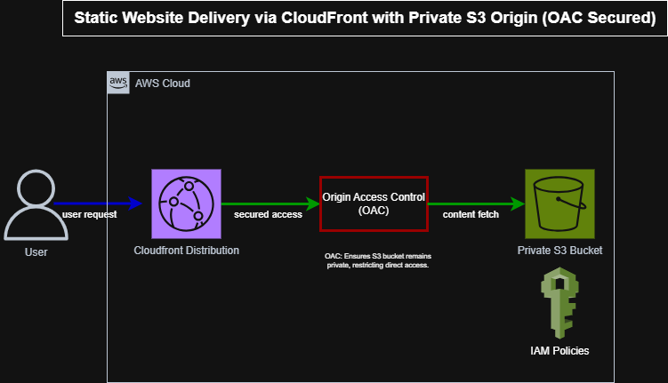

🛡️ AWS Secure Static Website Deployment | S3 + CloudFront + IAM

🔗 GitHub Repo: github.com/OluwatosinOsho/aws-secure-static-website-oac

🌍 Live Demo: CloudFront Link (Temporarily offline for cost control)

📄 Overview

A secure, scalable, and production ready static website built using:

✅ Amazon S3 for private content storage

✅ CloudFront for global content delivery

✅ Origin Access Control (OAC) and IAM for strict access control

✅ AWS CLI for full automation

✅ OWASP recommended security headers for browser protection

🎯 Why I Built This

Most tutorials oversimplify static site hosting by leaving S3 buckets public. That’s not secure or scalable. I wanted to:

🧠 Solve real world AWS security and cost risks

🔁 Practice automation first deployments

📚 Deepen my hands on skills in S3, CloudFront, and IAM

❌ Problems I Solved

ProblemSolutionPublic S3 access risksPrivate bucket + OACGlobal latencyCloudFront CDNManual updatesAWS CLI automation

✅ Architecture Highlights

ComponentDescriptionValue🔒 Private S3 BucketStores static website assetsEliminates public access🌐 CloudFront CDNDelivers content globallySpeeds up load time🛡️ Origin Access ControlRestricts access to S3Prevents direct access🔐 IAM PoliciesFine-grained access controlLeast privilege enforced⚡ Security HeadersCSP, HSTS, etc.OWASP compliance

🧱 Architecture Diagram

🧱 Architecture Diagram

🧪 Testing & Validation

TestStatusToolPublic access blocked✅Attempted direct S3 URLOAC enforcement✅Verified via CloudFront logsSecurity headers✅DevTools + securityheaders.comIAM accuracy✅AWS Policy SimulatorCDN performance✅CloudFront edge test

💡 Key Learnings

🔐 IAM & OAC

Spent hours refining Principal and Condition blocks to avoid "Access Denied" errors. Each fix deepened my IAM confidence.

⚙️ Automation Pitfalls

Learned about aws s3 sync --delete flag and how it can wipe content if not used carefully. Built scripts to minimize risk.

🧠 Response Headers

Set Strict-Transport-Security, Content-Security-Policy, and more. Confirmed visually via DevTools and header inspection tools.

🔎 Skills Demonstrated

AWS Core Services: S3, CloudFront, IAM

Security Engineering: OAC, security headers, IAM policies

DevOps: Bash scripting, AWS CLI automation, Git workflows

Documentation: Screenshots, README, and walkthroughs

📈 Business Value

Security: No open buckets. Strict IAM. Header hardening.

Performance: Global delivery. HTTPS. Smart caching.

Cost Efficiency: Zero idle resources. No EC2. 

🔄 What’s Next?

✅ Infrastructure as Code (Terraform or CDK)

✅ CI/CD Pipeline via GitHub Actions

✅ WAF Integration for DDoS and OWASP protection

🔍 Investigate Lambda@Edge for SSR capabilities

📸 Screenshots

✅ Full step-by-step screenshots available in the screenshots/ folder, including:

OAC setup

IAM policy simulator

Response header policies

CLI deploy logs

🧠 Project Reflection

Securing a static site isn't about ticking boxes. It's about building defense in depth from day one. This project helped me move from basic S3 hosting to a secure, global, cost optimized architecture.

📖 Read the Full Reflection Here → docs/PROJECT_REFLECTION.md

💬 Let’s Connect

PlatformLink🔗 GitHubOluwatosinOsho 💼 LinkedIn[www.linkedin.com/in/oluwatosin-osho-b5485b173]✍️ Blog[https://oluwatosinosho.hashnode.dev/]

